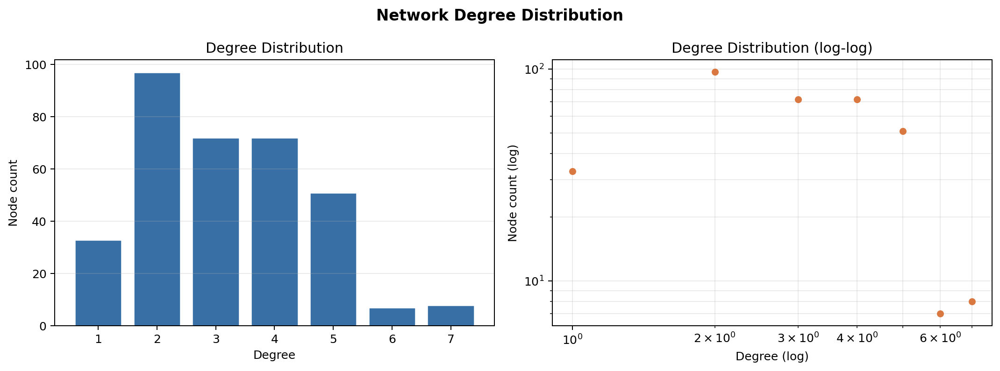
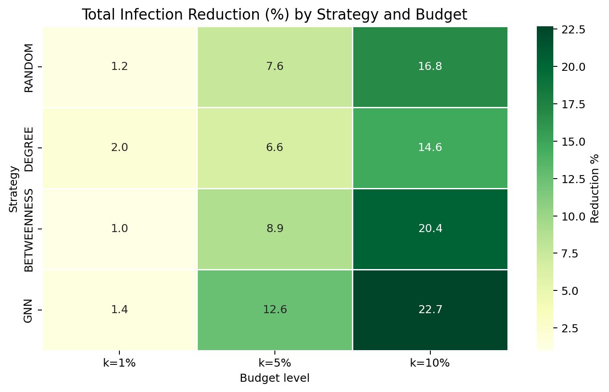
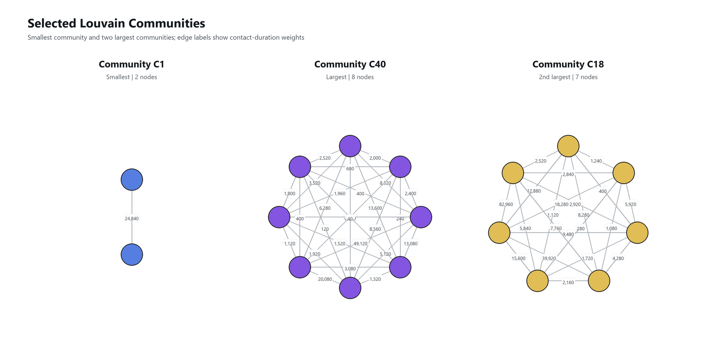

# CostTrace

**Budget-Constrained Epidemic Intervention on Household Contact Networks**

CostTrace is a reproducible social network analysis and epidemic intervention pipeline built on the SASHTS household contact dataset. The project turns raw proximity sensor events into a weighted contact graph, analyzes household-level network structure, learns node-level infection risk with a lightweight Weighted GraphSAGE proxy, and compares intervention strategies under limited public-health budgets.

The central question is practical: **if only 1%, 5%, or 10% of individuals can be prioritized for testing, monitoring, isolation, or follow-up, which nodes should be selected to reduce transmission most effectively?**

This README is written from the final report artifacts in [`[SNA] REPORT.pdf`](%5BSNA%5D%20REPORT.pdf), [`[SNA] REPORT_EN.docx`](%5BSNA%5D%20REPORT_EN.docx), [`reports/report.tex`](reports/report.tex), and the generated results under [`results/`](results/).

## Table of Contents

- [Project Summary](#project-summary)
- [Key Findings](#key-findings)
- [Visual Report](#visual-report)
- [Dataset](#dataset)
- [Methodology](#methodology)
- [Pipeline Stages](#pipeline-stages)
- [Modeling Details](#modeling-details)
- [Evaluation Design](#evaluation-design)
- [Results and Analysis](#results-and-analysis)
- [Repository Structure](#repository-structure)
- [Installation](#installation)
- [How to Run](#how-to-run)
- [Important Artifacts](#important-artifacts)
- [Limitations](#limitations)
- [Future Work](#future-work)
- [References](#references)

## Project Summary

In a household epidemic network, individuals do not contribute equally to disease spread. Some nodes have many direct contacts, some bridge dense subgroups, and some combine structural importance with epidemiological risk factors such as index-case exposure, susceptibility, age group, or sleeping/caregiving relationships.

CostTrace models this setting as a **budget-constrained node selection problem**:

1. Build a weighted undirected contact graph from proximity sensor data.
2. Measure topology, centrality, community structure, and node-level risk.
3. Train a Weighted GraphSAGE proxy to rank infection risk.
4. Select top-k nodes under fixed budgets.
5. Evaluate each strategy with both counterfactual transmission blocking and SIR simulation.

The project compares four strategies:

| Strategy | Selection Rule | Interpretation |
|---|---|---|
| Random | Uniform random node selection, averaged across repeats | Resource allocation without network intelligence |
| Degree | Highest degree centrality | Prioritize nodes with many direct contacts |
| Betweenness | Highest betweenness centrality | Prioritize structural bridge nodes |
| GNN | Highest GraphSAGE infection probability | Prioritize learned multi-feature risk |

## Key Findings

- The SASHTS graph contains **340 individuals**, **88 household components**, and **542 weighted contact edges** aggregated from **140,542 raw proximity events**.
- The graph is sparse globally, but very dense within households: global density is **0.0094**, while average household density is **0.9633**.
- Louvain community detection recovers **88 communities**, matching the household components with **100% household agreement** and **0.9696 modularity**.
- The Weighted GraphSAGE proxy achieves **test AUC = 0.7669** and **test Average Precision = 0.8995**, which is useful for top-k ranking even though the dataset is small.
- At **1% budget** only 3 nodes can be selected. Degree is the best counterfactual strategy, with **4.6% prevention rate**.
- At **5% and 10% budgets**, GNN becomes clearly stronger, reaching **26.8%** and **49.0% prevention rate**, with SIR reductions of **22.2%** and **42.7%**.
- There is no universally dominant strategy. The best choice depends on budget size, evaluation metric, and whether explainability or learned risk ranking is more important.

## Visual Report

The visual material below is organized as an analytical report. Each figure is accompanied by a concise academic insight that explains what the visualization contributes to the research argument.

### Main Report Figures

<table>
  <tr>
    <td width="50%">
      
      <p><strong>Figure 1 - Network overview.</strong> This figure provides the global structural view of the SASHTS contact graph after event aggregation. The visualization shows that the network is not a single connected population-level system, but a collection of household-level components. Node sizing by degree centrality makes highly connected individuals visible, while community coloring confirms that exposure is organized primarily around household boundaries. This supports the methodological decision to evaluate topology and intervention effects at the household-component level rather than relying only on whole-graph metrics.</p>
    </td>
    <td width="50%">
      
      <p><strong>Figure 2 - Degree distribution.</strong> The degree distribution demonstrates that contact opportunities are bounded by household size, with no large-scale hub structure comparable to open social networks. Although maximum degree is limited, variation in degree still matters because within a small household even one additional direct contact can meaningfully change potential transmission coverage. The figure therefore justifies Degree Centrality as a strong low-budget baseline.</p>
    </td>
  </tr>
  <tr>
    <td width="50%">
      
      <p><strong>Figure 3 - Prevention-rate heatmap.</strong> The heatmap summarizes counterfactual prevention rate across strategies and budget levels, making the main non-linear result visually explicit. At 1% budget, Degree remains competitive because only three nodes are selected and direct contact coverage dominates. At 5% and 10%, GNN improves faster than the baselines, indicating that learned multi-feature ranking becomes more valuable once the intervention budget is large enough to exploit multiple risk signals.</p>
    </td>
    <td width="50%">
      
      <p><strong>Figure 4 - SIR reduction by strategy.</strong> This grouped comparison shows the reduction in simulated epidemic size under SIR dynamics after removing selected nodes. The pattern confirms that GNN is not only strong under observed-edge counterfactual analysis, but also under a dynamic propagation model. The widening gap between GNN and centrality baselines at higher budgets suggests that integrated risk ranking is more robust than relying on a single structural measure.</p>
    </td>
  </tr>
  <tr>
    <td width="50%">
      
      <p><strong>Figure 5 - SIR baseline.</strong> The baseline SIR curve establishes the reference epidemic behavior before any intervention is applied. It functions as the control condition for later comparisons, allowing every strategy to be interpreted in terms of reduction against the same simulated household-level outbreak process. This is important because raw prevention counts alone do not show how much the expected epidemic burden changes under stochastic transmission.</p>
    </td>
    <td width="50%">
      
      <p><strong>Figure 6 - Budget recommendation.</strong> The recommendation figure translates quantitative findings into an operational decision rule. For extremely small budgets, Degree is defensible because it is transparent, fast, and competitive in counterfactual prevention. For budgets of 5% or higher, GNN is recommended because it consistently improves both prevention rate and SIR reduction. The figure therefore bridges analytical evaluation and policy-facing prioritization.</p>
    </td>
  </tr>
</table>

### Topology and Intervention Figures

<table>
  <tr>
    <td width="50%">
      
      <p><strong>Figure 7 - Topology network view.</strong> This topology-focused visualization verifies the disconnected household structure of the graph and highlights the small-component nature of the empirical contact network. It helps explain why component-aware metrics are necessary: global shortest-path or centrality interpretations would be misleading when the population is partitioned into isolated household subgraphs.</p>
    </td>
    <td width="50%">
      
      <p><strong>Figure 8 - Connected components.</strong> The component analysis shows that each connected component corresponds to one household and that household sizes are small but heterogeneous. This provides an empirical basis for treating households as the unit of local transmission. It also explains why the intervention problem is sensitive at 1% budget: selecting only three nodes cannot cover many independent components.</p>
    </td>
  </tr>
  <tr>
    <td width="50%">
      
      <p><strong>Figure 9 - Louvain communities.</strong> The Louvain visualization demonstrates that detected communities align with household labels, supported by 88 communities, 0.9696 modularity, and 100% household agreement. In this dataset, community detection primarily validates the known data-generating structure rather than discovering hidden cross-household clusters. This finding is analytically important because it limits the expected advantage of bridge-oriented methods such as Betweenness.</p>
    </td>
    <td width="50%">
      
      <p><strong>Figure 10 - Centrality analysis.</strong> The centrality figure compares different structural notions of importance, including direct connectivity, weighted exposure intensity, bridge position, and closeness within households. The contrast between these measures shows that risk is multidimensional: some nodes are important because they contact many others, while others matter because contact duration or local position increases exposure. This motivates both the composite score and the GraphSAGE feature design.</p>
    </td>
  </tr>
  <tr>
    <td width="50%">
      
      <p><strong>Figure 11 - GraphSAGE model metrics.</strong> The model evaluation figure summarizes the predictive behavior of the Weighted GraphSAGE proxy across training, validation, and test splits. The high Average Precision indicates that the model is useful for ranking high-risk nodes, while the train-test gap warns that the small dataset creates overfitting risk. This supports the careful interpretation of GNN output as a prioritization score rather than a definitive clinical classifier.</p>
    </td>
    <td width="50%">
      
      <p><strong>Figure 12 - Intervention comparison.</strong> This figure integrates the main intervention metrics into a comparative view across budget levels and strategies. It makes clear that strategy ranking changes with budget: Degree is competitive when the selection set is extremely small, whereas GNN becomes dominant when more nodes can be selected. The figure therefore supports the central conclusion that intervention design must be budget-sensitive rather than based on a single universal ranking rule.</p>
    </td>
  </tr>
  <tr>
    <td width="50%">
      
      <p><strong>Figure 13 - Strategy overlap.</strong> The overlap visualization examines whether different strategies select the same individuals. Greater overlap between Degree and GNN suggests that the learned model still recognizes direct contact intensity as a major risk signal, while divergence from Betweenness indicates that bridge-like nodes are not always transmission-relevant in isolated household components. This figure clarifies why strategy performance differs even when all methods use the same underlying graph.</p>
    </td>
    <td width="50%">
      
      <p><strong>Figure 14 - Gephi Louvain selected communities.</strong> The Gephi-based community visualization offers an external layout-oriented validation of the Louvain results. By coloring selected communities in a graph exploration environment, it confirms that household modules are visually separable and structurally compact. This reinforces the interpretation that transmission dynamics in SASHTS are dominated by local household clusters rather than by broad inter-community mixing.</p>
    </td>
  </tr>
</table>

## Dataset

CostTrace uses the **SASHTS - South Africa Household Transmission Study** dataset.

| Property | Value |
|---|---:|
| Raw proximity events | 140,542 |
| Individuals / nodes | 340 |
| Aggregated weighted contact edges | 542 |
| Households / connected components | 88 |
| Average household size | 3.86 |
| Average household density | 0.9633 |
| Overall graph density | 0.0094 |
| Average degree | 3.19 |
| Maximum degree | 7 |
| SARS positive individuals | 241 |
| SARS negative individuals | 99 |
| Observed attack rate | 70.9% |
| Index cases | 88 |
| Transmission edges | 286 |
| Non-transmission edges | 256 |

Available node attributes include site, age group, sex, SARS status, index/contact role, susceptibility, BMI category, smoking status, sleep-room exposure, caregiving exposure, virus variant, and household attack rate.

Site distribution:

| Site | Individuals |
|---|---:|
| Soweto | 197 |
| Klerksdorp | 143 |

Variant distribution:

| Variant | Count |
|---|---:|
| Beta | 171 |
| Delta | 38 |
| Variant Unknown | 16 |
| non-Alpha/Beta/Delta | 14 |
| Alpha | 13 |

## Methodology

The project follows a full research pipeline from raw event logs to intervention recommendation.


### Detailed Research Procedure

**Step 1 - Data acquisition and source verification.** The study begins by loading raw proximity events from [`data/raw/sashts/sashts_contact_network.csv`](data/raw/sashts/sashts_contact_network.csv) and participant metadata from [`data/raw/sashts/sashts_metadata.csv`](data/raw/sashts/sashts_metadata.csv). At this stage, the pipeline verifies record counts, checks missingness, identifies the distinction between real and unavailable timestamps, and confirms that the raw files match the SASHTS household-transmission setting described in the report.

**Step 2 - Contact-event curation.** Raw sensor events are standardized before graph construction. Self-loops are removed, unordered individual pairs are canonicalized so that A-B and B-A are treated as the same dyad, and repeated proximity observations are aggregated into a single pair-level contact record. The resulting edge weight is total contact duration in seconds, while contact frequency is retained as an additional exposure-intensity attribute.

**Step 3 - Metadata integration and graph construction.** Each individual is represented as a node, and each aggregated contact pair is represented as an undirected weighted edge. Node attributes such as site, age group, sex, SARS status, index/contact role, susceptibility, sleep-room exposure, caregiving exposure, and household identifier are attached to the graph. The core outputs of this stage are [`data/processed/sashts/graph.pkl`](data/processed/sashts/graph.pkl), [`data/processed/sashts/nodelist.csv`](data/processed/sashts/nodelist.csv), [`data/processed/sashts/edgelist.csv`](data/processed/sashts/edgelist.csv), and the Gephi export [`results/gephi/contact_network.gexf`](results/gephi/contact_network.gexf).

**Step 4 - Descriptive topology analysis.** The graph is analyzed as 88 connected household components rather than as a single connected population graph. The pipeline computes global and household-level statistics, including node count, edge count, component count, density, average degree, maximum degree, household-size distribution, clustering, and transmission-edge distribution. This step establishes the empirical fact that the network is globally sparse but locally dense inside households.

**Step 5 - Centrality and community characterization.** The analysis then computes Degree Centrality, Weighted Degree, Betweenness Centrality, and Closeness Centrality for each node, while Louvain community detection is used to test whether the graph structure recovers household boundaries. The finding that Louvain identifies 88 communities with 100% household agreement validates the household component as the dominant structural unit of analysis.

**Step 6 - Interpretable risk-score synthesis.** A composite risk score is constructed from normalized degree centrality, normalized weighted contact duration, normalized betweenness centrality, and sleep-room exposure. The score is intentionally interpretable: it combines direct contact opportunity, cumulative exposure intensity, structural bridging, and household exposure context. It serves as both a baseline risk ranking and a bridge between classical social network analysis and graph-learning features.

```text
composite_risk_score =
  0.35 * degree_centrality_norm
+ 0.30 * weighted_degree_sec_norm
+ 0.20 * betweenness_centrality_norm
+ 0.15 * sleep_room_enc
```

**Step 7 - Weighted GraphSAGE risk modeling.** A pure-PyTorch Weighted GraphSAGE proxy is trained to estimate node-level SARS positivity risk from structural features and epidemiological metadata. Edge weights are transformed using `log1p(total_duration_sec)` and row-normalized for weighted mean aggregation. The model is evaluated with stratified train, validation, and test splits, and its output is used primarily as a ranking signal for intervention rather than as a standalone diagnostic classifier.

**Step 8 - Budget-constrained node allocation.** The project formulates intervention as a top-k node selection problem under three budget levels: 1% equals 3 nodes, 5% equals 17 nodes, and 10% equals 34 nodes. Four strategies are compared under the same budgets: Random, Degree, Betweenness, and GNN. Random selection is averaged across repeated samples, while the deterministic strategies rank nodes by their corresponding score.

**Step 9 - Counterfactual and simulation-based evaluation.** Intervention effectiveness is measured through two complementary evaluation layers. Counterfactual transmission analysis estimates how many observed transmission edges and secondary/contact infections would be blocked if selected nodes were intervened on. SIR simulation then evaluates how much the expected household epidemic size decreases after node removal, using `beta = 0.25`, `gamma = 0.10`, a 30-day horizon, 50 Monte Carlo runs, and log-duration-scaled transmission probabilities.

**Step 10 - Reporting, visualization, and reproducibility.** Final tables, charts, notebook figures, and report artifacts are generated from the structured outputs under [`results/`](results/). The final comparison table, strategy summary, GraphSAGE metrics, topology figures, intervention figures, and Gephi exports make the analysis auditable and reproducible through the single entrypoint [`main.py`](main.py).

## Pipeline Stages

The executable entrypoint is [`main.py`](main.py). It organizes the project into five reproducible phases.

| Phase | Main Scripts | Purpose |
|---|---|---|
| `prepare` | `audit.py`, `curation.py`, `graph.py`, `profile.py` | Validate raw data, clean events, build graph, export EDA summary |
| `metrics` | `topology.py`, `centrality.py`, `community.py`, `risk.py` | Compute topology, centrality, Louvain communities, composite risk |
| `model` | `graphsage.py` | Train Weighted GraphSAGE and export risk scores |
| `budget` | `allocation.py`, `counterfactual.py`, `simulation.py`, `evaluation.py` | Select nodes, evaluate transmission blocking, run SIR, summarize results |
| `notebooks` | `notebooks.py` | Generate notebook-oriented figures and report visuals |

## Modeling Details

### Input Features

The GraphSAGE proxy uses 11 features:

| Feature | Type | Meaning |
|---|---|---|
| `degree_centrality_norm` | Continuous | Normalized degree centrality |
| `weighted_degree_sec_norm` | Continuous | Normalized total contact duration |
| `betweenness_centrality_norm` | Continuous | Normalized bridge-like structural role |
| `closeness_centrality_norm` | Continuous | Normalized average distance to household members |
| `sleep_room_enc` | Binary | Slept in same room as index case |
| `cared_by_enc` | Binary | Was cared for by index case |
| `age_enc_scaled` | Ordinal scaled | Encoded age group |
| `sex_enc` | Binary | Male/Female encoding |
| `sus_enc` | Binary | Susceptibility encoding |
| `site_enc` | Binary | Soweto/Klerksdorp encoding |
| `is_index` | Binary | Index-case role |

### Training Configuration

| Setting | Value |
|---|---|
| Model | `WeightedGraphSAGEClassifier` |
| Implementation | Pure PyTorch weighted mean aggregation |
| Hidden dimension | 32 |
| Epochs | 500 |
| Best epoch | 150 |
| Optimizer | Adam |
| Learning rate | 0.01 |
| Weight decay | 5e-4 |
| Split | Stratified 70% train, 15% validation, 15% test |
| Threshold | 0.24 |
| Seed | 42 |
| Edge weighting | `log1p(total_duration_sec)`, row-normalized |

### Model Performance

| Split | AUC | Average Precision | F1 | Precision | Recall |
|---|---:|---:|---:|---:|---:|
| Train | 0.9914 | 0.9966 | 0.9619 | 0.9480 | 0.9762 |
| Validation | 0.8036 | 0.9162 | 0.8732 | 0.8857 | 0.8611 |
| Test | 0.7669 | 0.8995 | 0.8158 | 0.7949 | 0.8378 |

The train-test gap indicates overfitting risk, which is expected with only 340 nodes. However, the high test Average Precision suggests that the model is still useful for ranking high-risk nodes.

## Evaluation Design

CostTrace evaluates interventions with three complementary views:

| Metric Family | Question Answered |
|---|---|
| Top-k selection | Are selected nodes actually high-risk or transmission-relevant? |
| Counterfactual transmission | How many observed transmission edges and secondary cases would be blocked? |
| SIR simulation | How much does simulated epidemic size decrease after node removal? |

Important metrics:

- `precision_k_pct`: percentage of selected nodes that are SARS positive.
- `transmission_coverage`: percentage of observed transmission edges incident to selected nodes.
- `prevention_rate_pct`: percentage of SARS-positive contact cases prevented in counterfactual analysis.
- `reduction_vs_baseline_pct`: SIR reduction against baseline mean infected per household.

## Results and Analysis

### Final Strategy Comparison

| Budget | Nodes | Strategy | Precision@k | Transmission Coverage | Prevention Rate | SIR Reduction |
|---:|---:|---|---:|---:|---:|---:|
| 1% | 3 | Degree | 100.0% | 2.4% | **4.6%** | 2.0% |
| 1% | 3 | GNN | 100.0% | 2.1% | 3.9% | **3.8%** |
| 1% | 3 | Random | 71.7% | 1.7% | 3.3% | 1.2% |
| 1% | 3 | Betweenness | 66.7% | 0.3% | 0.7% | 1.0% |
| 5% | 17 | GNN | 100.0% | 14.3% | **26.8%** | **22.2%** |
| 5% | 17 | Random | 70.8% | 9.7% | 17.4% | 7.6% |
| 5% | 17 | Betweenness | 64.7% | 6.3% | 11.8% | 8.9% |
| 5% | 17 | Degree | 64.7% | 8.4% | 10.5% | 6.6% |
| 10% | 34 | GNN | 100.0% | 26.2% | **49.0%** | **42.7%** |
| 10% | 34 | Random | 70.7% | 19.2% | 33.0% | 16.8% |
| 10% | 34 | Betweenness | 70.6% | 16.4% | 30.7% | 20.4% |
| 10% | 34 | Degree | 64.7% | 17.1% | 22.2% | 14.6% |

### Interpretation by Budget

**1% budget.** Only three nodes are selected, so results are sensitive to individual node choice. Degree performs best in counterfactual prevention because the highest-degree nodes directly cover more transmission edges in small household components. GNN still produces the best SIR reduction, but the margin is small.

**5% budget.** GNN becomes the strongest strategy. It selects 17 nodes with 100% Precision@k and reaches 26.8% prevention rate. This shows that once more than a handful of nodes can be selected, multi-feature learned ranking becomes more useful than single centrality metrics.

**10% budget.** GNN dominates both evaluation layers. It blocks 75 observed transmission edges, reaches 49.0% prevention rate, and reduces simulated infections by 42.7% against baseline.

**Why Betweenness is weaker here.** Betweenness is usually important for bridge nodes, but SASHTS is composed of disconnected household components with no cross-household links. In this setting, bridge-like structure is less decisive than direct exposure, contact duration, and household infection risk.

**Why Degree remains important.** Degree is transparent and strong at ultra-low budget. If an intervention team needs a fast and explainable rule when only a tiny number of people can be selected, Degree is a reasonable first baseline.

**Why GNN improves at larger budgets.** GNN combines centrality, weighted contact duration, household exposure indicators, susceptibility, demographics, site, and index-case role. This helps it recover risk patterns that no single centrality metric can express.

## Repository Structure

```text
CostTrace/
  data/
    raw/                     Raw SASHTS files and source notes
    processed/               Cleaned edges, nodes, graph object, EDA summary
  logs/                      Pipeline logs
  models/                    Trained GNN weights and metadata
  notebooks/                 Generated topology and intervention notebooks
  reports/
    report.tex               Final report source
    slides.pptx              Presentation deck
  results/
    gephi/                   Gephi-compatible graph export
    metrics/                 Topology, centrality, community, risk outputs
    model/                   GNN metrics and node risk scores
    intervention/            Top-k, counterfactual, SIR, final comparison
    figures/                 Notebook/report figures
  scripts/                   Extra chart and console-report scripts
  src/costtrace/
    preparation/             Data audit, cleaning, graph building, profiling
    analysis/                Topology, centrality, community, risk scoring
    modeling/                Weighted GraphSAGE proxy
    intervention/            Allocation, counterfactual, SIR, evaluation
    reporting/               Notebook and figure generation
  visualizations/            Main report charts and Gephi CSV exports
  main.py                    Pipeline entrypoint
  requirements.txt           Python dependencies
```

## Installation

Use Python 3.10 or newer.

```powershell
python -m venv .venv
.\.venv\Scripts\Activate.ps1
pip install -r requirements.txt
```

Dependencies:

```text
numpy
pandas
matplotlib
networkx
scikit-learn
torch
openpyxl
ipykernel
```

## How to Run

Run the full pipeline:

```powershell
python main.py --phase all
```

Run individual stages:

```powershell
python main.py --phase prepare
python main.py --phase metrics
python main.py --phase model
python main.py --phase budget
python main.py --phase notebooks
```

Recommended order for a clean reproduction:

1. `prepare` to rebuild cleaned data and graph artifacts.
2. `metrics` to recompute topology, centrality, communities, and risk features.
3. `model` to retrain Weighted GraphSAGE and export node risk scores.
4. `budget` to rerun top-k allocation, counterfactual analysis, SIR simulation, and final comparison.
5. `notebooks` to regenerate visual reporting artifacts.

The pipeline uses fixed seeds where randomness is involved. Small numeric differences can still appear if library versions differ.

## Important Artifacts

| Artifact | Purpose |
|---|---|
| [`data/processed/sashts/graph.pkl`](data/processed/sashts/graph.pkl) | NetworkX graph after preprocessing |
| [`data/processed/sashts/edgelist.csv`](data/processed/sashts/edgelist.csv) | Weighted edge list for analysis |
| [`data/processed/sashts/nodelist.csv`](data/processed/sashts/nodelist.csv) | Node attributes and graph features |
| [`data/processed/sashts/eda_summary.json`](data/processed/sashts/eda_summary.json) | Dataset summary statistics |
| [`results/metrics/basic_metrics.json`](results/metrics/basic_metrics.json) | Core topology metrics |
| [`results/metrics/centrality_scores.csv`](results/metrics/centrality_scores.csv) | Centrality table |
| [`results/metrics/community_metrics.json`](results/metrics/community_metrics.json) | Louvain community metrics |
| [`results/metrics/node_scores.csv`](results/metrics/node_scores.csv) | Composite risk and encoded features |
| [`results/model/gnn_metrics.json`](results/model/gnn_metrics.json) | GraphSAGE performance metrics |
| [`results/model/gnn_risk_scores.csv`](results/model/gnn_risk_scores.csv) | GNN infection probabilities |
| [`results/intervention/topk_budget_results.csv`](results/intervention/topk_budget_results.csv) | Top-k selection metrics |
| [`results/intervention/counterfactual_results.csv`](results/intervention/counterfactual_results.csv) | Counterfactual prevention metrics |
| [`results/intervention/sir_intervention_results.csv`](results/intervention/sir_intervention_results.csv) | SIR intervention results |
| [`results/intervention/final_comparison.csv`](results/intervention/final_comparison.csv) | Final strategy comparison table |
| [`results/intervention/final_strategy_summary.json`](results/intervention/final_strategy_summary.json) | Best strategy by budget |
| [`results/gephi/contact_network.gexf`](results/gephi/contact_network.gexf) | Graph export for Gephi |
| [`notebooks/topology.ipynb`](notebooks/topology.ipynb) | Topology and centrality notebook |
| [`notebooks/intervention.ipynb`](notebooks/intervention.ipynb) | Intervention and recommendation notebook |

## Limitations

- The dataset has only 340 nodes and is organized as household components, so conclusions should not be generalized directly to large urban, school, workplace, or online social networks.
- Klerksdorp records do not contain real timestamps, so the current graph is effectively static rather than temporal.
- The model is a lightweight GraphSAGE proxy, not a full reproduction of DeepTrace.
- The train-test performance gap suggests overfitting risk due to small sample size.
- Counterfactual removal assumes selected nodes can be fully intervened on, which is a simplifying public-health assumption.
- The SIR model uses calibrated assumptions and log-duration scaling, not a clinically validated transmission model.
- The current intervention logic does not explicitly filter out already recovered or non-infectious individuals.

## Future Work

- Extend the graph from static household components to temporal contact windows.
- Add recovery-aware candidate filtering to avoid spending budget on nodes that no longer transmit.
- Integrate spatial and temporal metadata for richer risk modeling.
- Validate the strategy trade-off on larger contact-network datasets such as schools, hospitals, workplaces, and public spaces.
- Compare the pure-PyTorch proxy against PyTorch Geometric implementations and more expressive GNN architectures.
- Develop an online decision-support version that updates node rankings as new contact events arrive.

## References

- Hamilton, W. L., Ying, R., and Leskovec, J. (2017). Inductive representation learning on large graphs. *NeurIPS*.
- Blondel, V. D., Guillaume, J. L., Lambiotte, R., and Lefebvre, E. (2008). Fast unfolding of communities in large networks. *Journal of Statistical Mechanics: Theory and Experiment*.
- Kermack, W. O., and McKendrick, A. G. (1927). A contribution to the mathematical theory of epidemics. *Proceedings of the Royal Society of London. Series A*.
- Keeling, M. J., and Eames, K. T. D. (2005). Networks and epidemic models. *Journal of the Royal Society Interface*.
- Kiss, I. Z., Miller, J. C., and Simon, P. L. (2017). *Mathematics of Epidemics on Networks*. Springer.
- Tan, C. W., Yu, P. D., Chen, S., and Poor, H. V. (2025). DeepTrace: Learning to optimize contact tracing in epidemic networks with graph neural networks.
- Kleynhans, J. et al. SASHTS - South Africa Household Transmission Study physical proximity contact sensor data and epidemiological outcomes.

## Project Status

This repository is intended for academic research and coursework. It demonstrates how social network analysis, graph learning, and epidemic simulation can support budget-aware intervention planning. It is not a medical decision system and should not be used as direct public-health guidance without expert validation.
